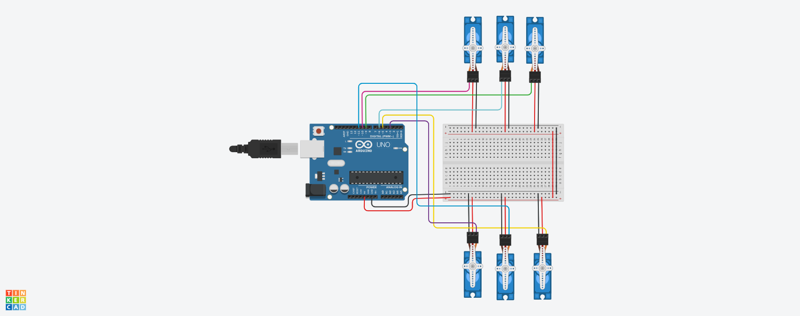

# Electronics – 6 Servo Motor Control with Arduino



This project demonstrates how to control 6 servo motors using an Arduino Uno. The servos sweep initially, then hold position at 90 degrees.

---

## 🎯 Objective
- Control 6 servo motors connected to Arduino
- Sweep all motors for 2 seconds
- Hold all motors at 90° angle
- Write a simple walking motion algorithm

---

## 🛠 Components Used
- Arduino Uno  
- 6x Servo Motors  
- Breadboard  
- Jumper Wires  

---

## 💡 Description
Each servo is connected to a digital PWM pin (3, 5, 6, 9, 10, 11).  
In the setup(), we sweep each servo to 180° then return to 90°.  
After that, the servos hold steady at 90°.

---

## 🧠 Walking Algorithm (Conceptual)
To simulate a humanoid walking motion:
- Alternate movement between left and right legs
- Shift body weight during each step
- Move opposite arms for balance

This can be programmed later by combining servo delays and alternating angles.

---

## 📂 Files Included
- servo_control.ino – Arduino code  
- circuit.png – Screenshot of circuit simulation  
- README.md – This documentation

---

## ✅ Output
- Simulation on Tinkercad shows all motors responding and holding steady at 90°

## 🔧 Arduino Code

```cpp
#include <Servo.h>

Servo servo1, servo2, servo3, servo4, servo5, servo6;

void setup() {
  servo1.attach(3);
  servo2.attach(5);
  servo3.attach(6);
  servo4.attach(9);
  servo5.attach(10);
  servo6.attach(11);

  for (int angle = 0; angle <= 180; angle += 5) {
    servo1.write(angle);
    servo2.write(angle);
    servo3.write(angle);
    servo4.write(angle);
    servo5.write(angle);
    servo6.write(angle);
    delay(50);
  }

  servo1.write(90);
  servo2.write(90);
  servo3.write(90);
  servo4.write(90);
  servo5.write(90);
  servo6.write(90);
}

void loop() {
  // Do nothing
}
